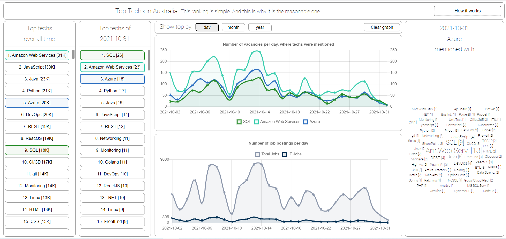
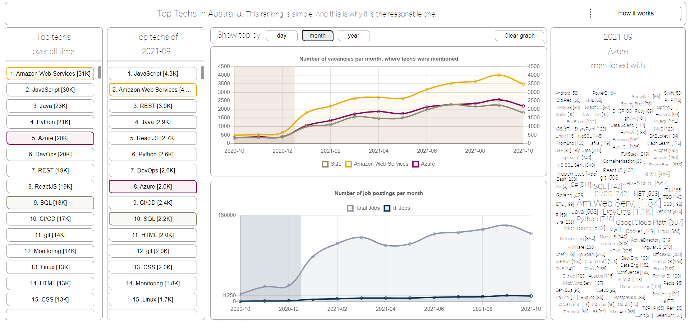

# toptechs-public

Open sources of the code behind toptechs.xyz. It is now down and nonfunctional since scraping-data-provider have locked down the open api access.

Feel free to serf throuhg the code.

For historical purposes this is how the toptechs.xyz looked like:

You could see:
  - how techs were gaining and loosing popularity on the jobs market
  - treands ovr days/months/years
  - how frequently tech `A` was mentioned together with tech `B`
  - how dev jobs market were changing with regards to the overall market

Pics:  
  
  

Sleep well dear friend.